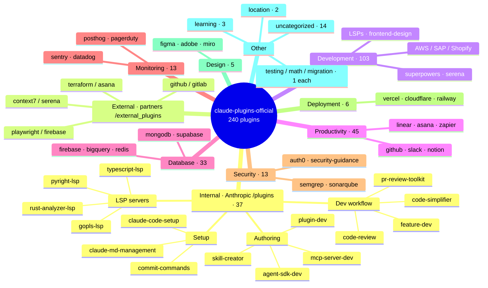

# claude-plugins-official

The **official Anthropic plugin marketplace** for [[claude-code]] — a curated catalog of
**240 plugins** (37 first-party + a large third-party set) that Claude Code's
[[claude-code-plugin-marketplace|plugin system]] browses and installs from.

## Summary
`claude-plugins-official` is the GitHub-backed marketplace `anthropics/claude-plugins-official`,
registered locally in `~/.claude/plugins/known_marketplaces.json` and checked out to
`~/.claude/plugins/marketplaces/claude-plugins-official/` (last synced **2026-06-26**). Its
manifest, `.claude-plugin/marketplace.json`, lists **240 plugin entries** grouped into two
trust tiers and ~12 categories. You install any entry with
`/plugin install <name>@claude-plugins-official`, or browse `/plugin > Discover`. _All counts
below were read from the live manifest and directory tree on 2026-06-28._

## Map

## Structure
Two trust tiers (see the marketplace `README.md`):

- **`/plugins`** — **37** internal plugins developed and maintained by Anthropic
  (reference implementation: `example-plugin`).
- **`/external_plugins`** — third-party plugins from partners/community (**15** checked out
  locally), vetted for quality/security but **not** controlled or guaranteed by Anthropic —
  *trust before installing*.

The **240** figure is the full *discoverable* catalog in `marketplace.json`; many entries
reference external source repos that are not checked out locally. What is actually active is
only what you `/plugin install` (this machine: **2** enabled — see [[claude-code]]).

Category sizes (entries in the manifest):

| Category | Count | | Category | Count |
|---|--:|---|---|--:|
| development | 103 | | deployment | 6 |
| productivity | 45 | | design | 5 |
| database | 33 | | learning | 3 |
| monitoring | 13 | | location | 2 |
| security | 13 | | testing / math / migration | 1 each |
| _(uncategorized)_ | 14 | | **Total** | **240** |

## Skill-bundle entries
Some repos ship `SKILL.md` skills with no `.claude-plugin/plugin.json`. The marketplace can
still expose them via a `strict: false` entry with an explicit `skills: [...]` array
(`source: git-subdir`); each skill registers as `<plugin-name>:<skill-name>`. See
[[claude-code-plugin-marketplace]].

## Related
- [[claude-code-plugin-marketplace]] — the general mechanism this is an instance of
- [[claude-code-plugin]] — what each catalog entry installs
- [[claude-code]] — the host tool that registers and loads it
- [[2026-06-28-claude-plugins-marketplace-map]] — the session that produced this page

## Open questions
- Catalog is a 2026-06-26 snapshot; counts drift as Anthropic adds/removes entries.
- Which 2 plugins are enabled locally beyond the confirmed `claude-code-setup`.
